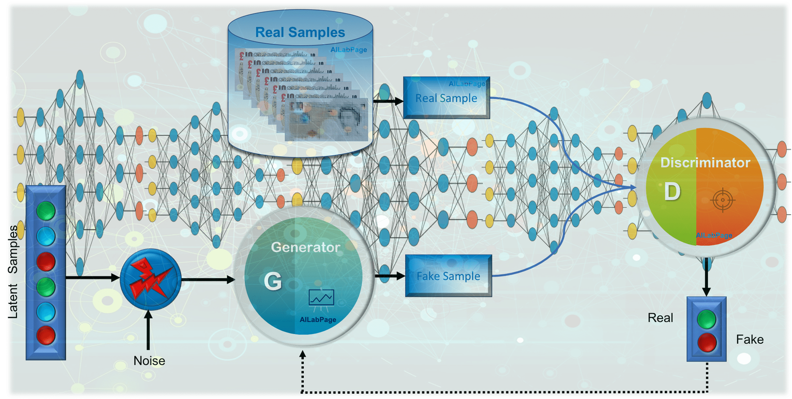

### Use machine learning GAN methods to create fashions
A nice article on  [GAN Basics](https://vinodsblog.com/2018/11/23/generative-adversarial-networks-gans-the-basics-you-need-to-know/?fbclid=IwAR3BHLHnaZiwkfsUehYmvm642s3j2A7UHFOpNSqynwDgX5STeU7Ic7GYhq0)

